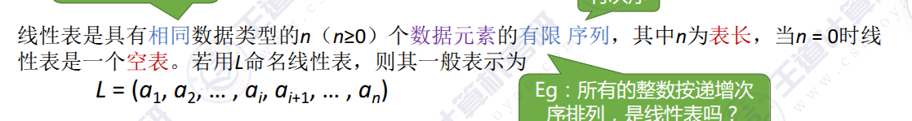
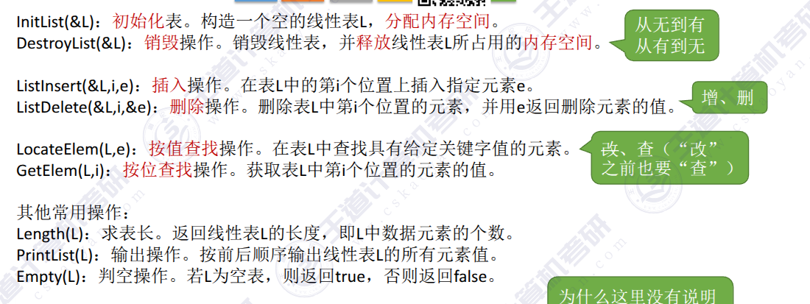
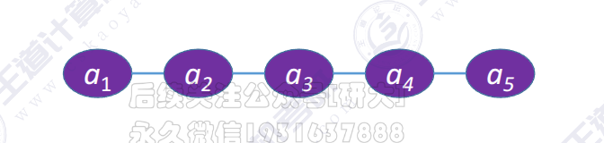
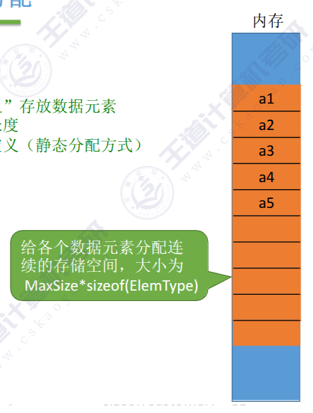

# 第二章  线性表

## 1.1 线性表的定义及基本操作

### 1.1.1 定义（逻辑结构）



### 1.1.2  基本操作

> 创销  增删改差



## 1.2  线性表的存储（物理）结构

### 1.2.1   顺序表（顺序存储）

> 逻辑上相邻的元素存储在物理位置也相邻的存储单元中





#### 1.2.1.1  静态存储代码实现基本操作

[静态顺序表](</home/wly/考研/专业课/数据结构/第二章 线性表/代码/1-静态分配.cpp>)

```C++
#include <iostream>


#define MAXSIZE 10

//顺序表的定义
typedef struct {
    int data[MAXSIZE];
    int len;
}Sqlist;


//1.初始化顺序表
//每一个位置=0,len=0
void InitList(Sqlist &L){
    //不初始化为0,内存会有脏数据
    for(int i=0;i<MAXSIZE;i++){
        L.data[i]=0;
    }
    L.len=0;
}

//2.插入 --在第i位置插入e
bool InsretList(Sqlist &L,int i,int e){
    if(i<1 || i>L.len)  return false;
    if(L.len >=MAXSIZE)  return false;
    for(int j=L.len;j>=i;j++){
        L.data[j]=L.data[j-1];
    }
    L.data[i-1]=e;
    L.len++;
    return true;

}

//3.删除，带值返回
bool DeleteList(Sqlist &L,int i,int &e){
    if(i<1||i>L.len) return false;
    e=L.data[i-1];
    for(int j=i;j<L.len;j++){
        L.data[j-1]=L.data[j];
    }
    L.len--;
    return true;
}

int FindByPos(Sqlist &L,int i){
    return L.data[i-1];
}

int FindByValue(Sqlist &L,int e){
    for(int i=0;i<L.len;i++){
        if(L.data[i]==e){
            return i+1;
        }
    }
    return -1;
}


int main(){
    Sqlist L;
  
  

    //1.初始化顺序表
    InitList(L);

    //2.插入
    InsretList(L, 2, 3);

    //3.删除
    int e=-1;
    DeleteList(L, 2,e);

    //4.1 按位查找
    int a=FindByPos(L, 1);

    //4.2 按值查找
  


    return 0;
}
```

#### 1.2.1.2 动态分配代码

```C++
#include <cstdlib>
#include <iostream>


#define INITSIZE 10

//顺序表的定义
typedef struct  {
    int *data;
    int MAXSIZE;
    int len;
}Sqlist;


//1.初始化顺序表
//每一个位置=0,len=0
void InitList(Sqlist &L){
    L.data=(int*)malloc(sizeof(int)*INITSIZE);
    L.len=0;
    L.MAXSIZE=INITSIZE;
}

//增加动态数组的长度
void IncreaseSize(Sqlist &L,int len){
    L.data=(int*)malloc(sizeof(int)*(L.MAXSIZE+len));
    int *p=L.data;
    for(int i=0;i<L.len;i++){
        L.data[i]=p[i];
    }
    L.MAXSIZE=L.MAXSIZE+len;
    free(p);
  
}


int main(){
    Sqlist L;
  
  
    //初始化顺序表
    InitList(L);


    return 0;
}
```


## 1.2.2  链表（链式存储）
